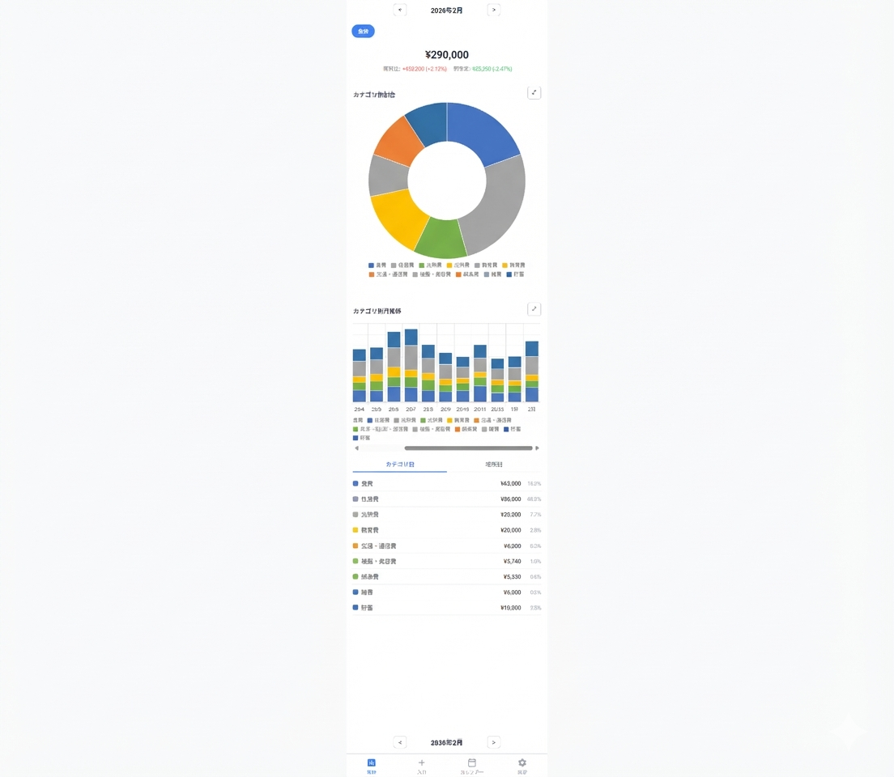

# Money Diary


シンプルな家計簿 Web アプリ。スマートフォンからの日常入力に最適化しています。

## 機能

- **支出入力** — カテゴリ選択 + 電卓 UI（`500+300` のような計算対応）
- **カレンダービュー** — 日別の支出合計を一覧表示
- **支出一覧** — 月別表示、編集・削除
- **集計** — カテゴリ別ドーナツチャート、月別推移グラフ、前月比・前年比
- **支払元フィルタ** — 支払元ごとの集計と残額管理
- **定期支出** — 毎月/隔月の自動登録（EventBridge スケジュール）
- **メール自動取込・自動分類** — Gmail のカード利用通知を自動取得し、件名・本文キーワード・場所に応じて自動分類（[詳細ドキュメント](docs/gmail-import.md)）
- **設定画面** — カテゴリ・場所・支払元・メール分類ルールのマスタ管理
- **認証** — Google ログイン、許可メールアドレスのみアクセス可

## 構成

```
Browser (React 19 + TypeScript)
  ↓ HTTPS + Google ID Token
CloudFront
  ├─ /api/* → Lambda Function URL (Go) → DynamoDB
  └─ /*     → S3 (静的ファイル)

Gmail → GAS: Gmail取込 (gas/gmail-import/)
  ↓ Webhook (共有シークレット)
Lambda Function URL (Go) → DynamoDB

Gmail → GAS: LINE通知 (gas/line-notifier/) → LINE
```

| レイヤー | 技術 |
|---------|------|
| フロントエンド | React 19, TypeScript, Vite, Chart.js |
| バックエンド | Go, AWS Lambda (provided.al2023) |
| データベース | DynamoDB (オンデマンド) |
| 外部連携 | Google Apps Script (Gmail取込、LINE通知) |
| 認証 | Google OAuth 2.0 (ID Token 検証) |
| インフラ | CloudFront + S3 + Lambda Function URL (OAC) |
| IaC | AWS SAM |

## プロジェクト構成

```
├── lambda/                 # Go バックエンド
│   ├── cmd/api/main.go     #   エントリーポイント
│   ├── internal/
│   │   ├── handler/        #   Lambda ハンドラー
│   │   ├── auth/           #   Google ID Token 検証
│   │   ├── dynamo/         #   DynamoDB クライアント
│   │   ├── service/        #   ビジネスロジック
│   │   ├── parser/         #   カードメールパーサー
│   │   ├── model/          #   構造体定義
│   │   └── apperror/       #   エラー型
│   ├── template.yaml       #   SAM テンプレート
│   └── Makefile
├── frontend/               # React フロントエンド
│   └── src/
│       ├── pages/          #   各画面
│       ├── components/     #   共通コンポーネント
│       ├── contexts/       #   認証 Context
│       └── services/       #   API クライアント
├── gas/                    # Google Apps Script プロジェクト
│   ├── gmail-import/       #   Gmail取込
│   └── line-notifier/      #   LINE通知
├── docs/                   # 機能・設定詳細ドキュメント
└── scripts/                # デプロイスクリプト
```

GASの設定と反映手順は[GASプロジェクト一覧](gas/README.md)から参照できます。[Gmail取込](gas/gmail-import/README.md)と[LINE通知](gas/line-notifier/README.md)は別々のGASプロジェクトです。メールの取込仕様は[メール自動取込の説明](docs/gmail-import.md)、AWS側の作業は[デプロイ手順](docs/deploy.md)を参照してください。

## セットアップ

### 前提条件

- AWS CLI v2 + AWS アカウント
- Go 1.25.5+
- Node.js 20+
- AWS SAM CLI
- Google Cloud プロジェクト（OAuth 用）

### 1. 環境ファイルの準備

```bash
cp .env.setup.example .env.setup
cp lambda/samconfig.toml.example lambda/samconfig.toml
cp frontend/.env.example frontend/.env.production
cp frontend/.env.example frontend/.env.development
```

各ファイルを自分の環境に合わせて編集してください。

### 2. Google OAuth の設定

1. [Google Cloud Console](https://console.cloud.google.com/) でプロジェクトを作成
2. OAuth 同意画面を設定（外部 / テスト用にメールアドレスを追加）
3. 認証情報 → OAuth 2.0 クライアント ID を作成（Web アプリケーション）
   - 承認済み JavaScript 生成元: `http://localhost:5173` と CloudFront ドメイン
4. クライアント ID を `lambda/samconfig.toml` と `frontend/.env.*` に設定

### 3. バックエンドのデプロイ

```bash
cd lambda
make build
sam deploy --guided   # 初回のみ。2回目以降は ./scripts/deploy-backend.sh
```

### 4. 初期データの登録

デプロイ後、DynamoDB の master テーブルにマスタデータを登録します。

> アプリの設定画面（`/settings`）からも追加・編集できます。
> 最低限 **ユーザー 1 件 + カテゴリ 1 件** を登録すればアプリが使えます。

#### ユーザー登録（必須）

ログインに使う Google アカウントのメールアドレスを登録します。

```bash
MASTER_TABLE=money-diary-master  # sam deploy 時の出力を確認

aws dynamodb put-item --table-name $MASTER_TABLE --item '{
  "type": {"S": "user"},
  "id": {"S": "your-email@gmail.com"},
  "role": {"S": "admin"}
}'
```

#### カテゴリの例

以下は一般的な家計簿カテゴリの例です。必要に応じて追加・変更してください。

| # | カテゴリ | 色 | 備考 |
|---|---------|-----|------|
| 1 | 食費 | `#FF6384` | スーパー・食料品 |
| 2 | 外食 | `#FF9F40` | レストラン・カフェ |
| 3 | 日用品 | `#FFCD56` | 洗剤・消耗品 |
| 4 | 交通費 | `#4BC0C0` | 電車・バス・ガソリン |
| 5 | 住居費 | `#36A2EB` | 家賃・ローン |
| 6 | 光熱費 | `#9966FF` | 電気・ガス・水道 |
| 7 | 通信費 | `#C9CBCF` | スマホ・ネット回線 |
| 8 | 医療費 | `#E7E9ED` | 病院・薬 |
| 9 | 趣味・娯楽 | `#7BC8A4` | 旅行・映画・書籍 |
| 10 | 衣服・美容 | `#F7A35C` | 服・美容院 |
| 11 | 教育費 | `#8085E9` | 習い事・書籍 |
| 12 | 保険 | `#F15C80` | 生命保険・損害保険 |
| 13 | その他 | `#AEB6BF` | 上記に当てはまらないもの |
| 14 | 収入 | `#2ECC71` | 給料・副収入（集計から除外） |

```bash
# 登録例
aws dynamodb put-item --table-name $MASTER_TABLE --item '{
  "type": {"S": "category"},
  "id": {"S": "食費"}, "name": {"S": "食費"},
  "sortOrder": {"N": "1"}, "color": {"S": "#FF6384"},
  "isActive": {"BOOL": true}, "isExpense": {"BOOL": true}
}'
```

> `isExpense: false` のカテゴリ（収入など）は集計の合計に含まれません。

#### 支払元の例

| 名前 | 残額追跡 |
|------|---------|
| 現金 | - |
| クレジットカード | - |
| 銀行口座 | あり |
| 電子マネー | あり |

#### 場所の例

スーパー、コンビニ、ドラッグストア、ネット通販、その他 など

### 5. フロントエンドのデプロイ

```bash
# S3 バケット作成（初回のみ）
aws s3 mb s3://your-frontend-bucket

# デプロイ
./scripts/deploy-frontend.sh <S3バケット名> <CloudFront Distribution ID> frontend
```

### 6. CloudFront の設定

| ビヘイビア | オリジン | 備考 |
|-----------|---------|------|
| `/api/*` | Lambda Function URL | OAC (SigV4) |
| `/*` (デフォルト) | S3 バケット | OAC |

- エラーページ: 403 → `/index.html`（SPA ルーティング対応）

## ローカル開発

### AWS ログインなしで検証する

Go 1.25.5+、Docker Compose、Node.js 20+ を使用します。AWS CLI、SAM CLI、Google OAuth の設定は不要です。

```bash
# ターミナル 1: DynamoDB Local と API を起動
cd lambda
make dynamo-local
make local                 # http://127.0.0.1:8080/api

# ターミナル 2: フロントエンドを起動
cd frontend
npm install
npm run dev:local          # http://localhost:5173
```

ローカル専用ユーザー `local@example.test`（管理者）で自動ログインします。
API は本番と同じハンドラー・サービス・DynamoDB クエリを実行し、
初回起動時にローカル用のテーブル、ユーザー、食費カテゴリ、現金の支払元を作成します。
再起動しても既存のデータを保持します。データは Docker のボリュームに保存します。

フロントエンドの `offline` モードは開発サーバーでのみ有効です。
API サーバーは `127.0.0.1` にのみ待ち受け、DynamoDB の接続先もループバック IP に限定します。
本番 Lambda は従来どおり Google ID Token を検証します。

API 単体の確認例:

```bash
curl http://127.0.0.1:8080/api \
  -H 'Content-Type: application/json' \
  -H 'X-Auth-Token: money-diary-local' \
  -d '{"action":"getCategories"}'
```

検証コマンド:

```bash
cd lambda
make test
# DynamoDB Local 起動後に CRUD・認証・集計の統合テストも実行
LOCAL_DYNAMO_TEST_ENDPOINT=http://127.0.0.1:8000 go test ./...
```

`make test` は接続先未指定の統合テストを省略し、AWS に接続せず単体テストを実行します。
ローカルでは CloudFront/IAM、Google ID Token の署名検証、EventBridge の起動、
Gmail/GAS と Google Sheets バックアップの実接続は検証できません。

停止する場合は開発サーバーと API を終了し、`lambda` で次を実行します。
データは保持されます。

```bash
docker compose -f compose.local.yaml down
```

ポートを変更する場合は `go run ./cmd/local -port 8081 -dynamo-endpoint http://127.0.0.1:8001`
で API を起動します。フロントエンドは `LOCAL_API_URL=http://127.0.0.1:8081 npm run dev:local`
で接続先を変更できます（DynamoDB のポート割当も Compose 側で変更してください）。

### 日次バックアップからローカル DB に同期する

バックアップの `expenses` シートを CSV でダウンロードするか、Google Sheets API から直接読み取れます。
AWS 認証情報は使用せず、接続先をループバック上の DynamoDB Local に限定します。
Google Sheets の内容は変更しません。

```bash
# DynamoDB Local と API を起動した後、リポジトリのルートから実行
./scripts/sync-local-from-backup.sh -file ~/Downloads/expenses.csv -dry-run
./scripts/sync-local-from-backup.sh -file ~/Downloads/expenses.csv

# ローカルの支出をバックアップと一致させる場合（バックアップにない支出は削除）
./scripts/sync-local-from-backup.sh -file ~/Downloads/expenses.csv -replace
```

Google Sheets から直接取得する場合は、読み取り権限のある Google 認証情報を使用します。
`GOOGLE_APPLICATION_CREDENTIALS` に Google の認証 JSON ファイルを指定するか、
`GOOGLE_ACCESS_TOKEN` に Sheets の読み取り権限を持つ OAuth アクセストークンを設定してください。
サービスアカウントを使う場合は、そのアカウントに対象のスプレッドシートを閲覧共有してください。
必要なスコープは [`spreadsheets.readonly`](https://developers.google.com/workspace/sheets/api/scopes) です。
認証ファイルはリポジトリの外に保存します。

```bash
GOOGLE_APPLICATION_CREDENTIALS=/path/to/google-credentials.json \
  ./scripts/sync-local-from-backup.sh -spreadsheet-id <スプレッドシートID> -dry-run
GOOGLE_APPLICATION_CREDENTIALS=/path/to/google-credentials.json \
  ./scripts/sync-local-from-backup.sh -spreadsheet-id <スプレッドシートID>
```

`-sheet` でシート名（既定: `expenses`）、`-dynamo-endpoint` でローカル DB のポートを変更できます。
通常は ID ごとの追加・更新を行い、再実行しても支出が重複しません。
`-dry-run` は件数と追加マスタ・削除対象の件数を表示し、テーブル作成も含めて書き込みを行いません。
事前に `make local` でローカルのテーブルを初期化してください。
全行の形式と重複 ID を検証し、不正な行や空のバックアップがある場合は同期を停止します。
書き込み全体はトランザクションではないため、通信エラーで途中終了した場合は再実行してください。
同期後はブラウザーを再読み込みしてフロントエンドのキャッシュを更新します。

バックアップの列順は `id,date,payer,category,amount,memo,place,createdBy,createdAt,updatedAt,visibility` です。
`visibility` がない旧形式も使用できます。日時、ID、公開範囲、元の作成者を保持し、月別集計も再計算します。
カテゴリ名を既存のローカル ID に対応付け、不足するカテゴリ・支払元・場所は補完します。
バックアップにはマスタの色・集計除外・所有者・残高追跡などの設定が含まれないため、完全には復元できません。
新規カテゴリは「収入」以外を支出扱いにし、必要な設定はローカルの設定画面で調整してください。
同名カテゴリが複数ある場合は対応先を特定できないため停止します。

元の作成者の `private` 支出はローカル専用ユーザーから見えません。
検証用に全取込データの作成者を変更する場合は `-created-by local@example.test` を指定します。
この変更はローカル DB にだけ反映されます。

### デプロイ済み Lambda を使う

```bash
cd frontend
npm install
npm run dev
```

通常の開発モードでは Vite のカスタムプラグインが `/api` リクエストを
`aws lambda invoke` に転送します。この経路は AWS ログインと Google ログインが必要です。

## スクリプト

| スクリプト | 説明 |
|-----------|------|
| `scripts/sync-local-from-backup.sh` | 日次バックアップから DynamoDB Local へ同期 |
| `scripts/deploy-backend.sh` | Lambda ビルド + SAM デプロイ |
| `scripts/deploy-frontend.sh` | フロントエンドビルド + S3 同期 + CloudFront 無効化 |
| `scripts/deploy-gas.sh` | Gmail取込GASのソースをClaspでプッシュ |

## セキュリティ

### 認証・認可

- **Google OAuth 2.0** — フロントエンドで取得した ID Token を
  Lambda 側で `go-oidc/v3` により署名検証。
  DynamoDB の master テーブルに登録済みのメールアドレスのみアクセスを許可
- **シークレット管理** — API キーやクレデンシャルのハードコーディングなし。
  すべて環境変数 or SAM パラメータで管理

### API 保護

- **Lambda Function URL + CloudFront OAC** —
  Function URL の `AuthType: AWS_IAM` と CloudFront OAC（SigV4 署名）により、
  CloudFront 経由以外のアクセスを遮断。
  フロントエンドは POST ボディの SHA-256 ハッシュを
  `x-amz-content-sha256` ヘッダーで送信し署名整合性を維持
- **CORS ホワイトリスト** — `ALLOWED_ORIGIN` 環境変数で許可オリジンを制限

### Google Sheets API 接続

- **Workload Identity Federation（WIF）** —
  サービスアカウントキーファイルを持たずに、
  Lambda 実行ロールの AWS 認証情報から GCP STS 経由で Sheets API にアクセス。
  長期クレデンシャルの漏洩リスクを排除

## コスト

**AWS 無料枠内** で運用できるよう設計しています。

### コンピュート

- **Lambda 128 MB** — 最小メモリで十分な Go バイナリ。
  月 10,000 リクエスト程度では無料枠内
- **EventBridge Schedule** — 定期支出の月次登録 + 日次バックアップで
  月 60 イベント程度。無料枠（月 14M イベント）内

### データストア

- **DynamoDB オンデマンド** — 個人用途のリクエスト量は
  無料枠（読み取り 25 RRU / 書き込み 25 WRU、ストレージ 25 GB）に収まる
- **GSI `yearMonth-date-index`** — 月別クエリを Scan ではなく Query で実行し、
  読み取りユニット消費を最小化
- **集計キャッシュ** — 月別サマリーを DynamoDB にキャッシュ保存し、
  毎リクエストの再集計を回避

### 配信

- **CloudFront 無料プラン** — Flat-rate Free プラン（$0/月）を利用。
  月 100 GB 転送 / 100 万リクエストまで無料、WAF ルール 5 個・DDoS 保護付き。
  個人用途には十分で、超過時もオーバーチャージなし
- **キャッシュ戦略** — Vite のハッシュ付きアセットに
  `Cache-Control: public, max-age=31536000, immutable` を設定。
  キャッシュヒット率をほぼ 100% に維持し、S3 GET リクエストと転送量を削減
- **index.html のみ `no-cache`** — デプロイ時に最新バージョンを即時反映

### フロントエンド API キャッシュ

- マスタデータ・月別支出・集計をメモリキャッシュし、
  同一セッション内の重複 API 呼び出しを削減。Lambda 実行回数を 30〜50% 低減

### バックアップ

- **Google Sheets への日次全件洗い替え** — 個別の非同期バックアップ（CRUD ごと）ではなく、
  1 日 1 回の一括同期でシンプルさと整合性を両立。
  Sheets API 呼び出し回数も最小限に抑制

## ライセンス

MIT
